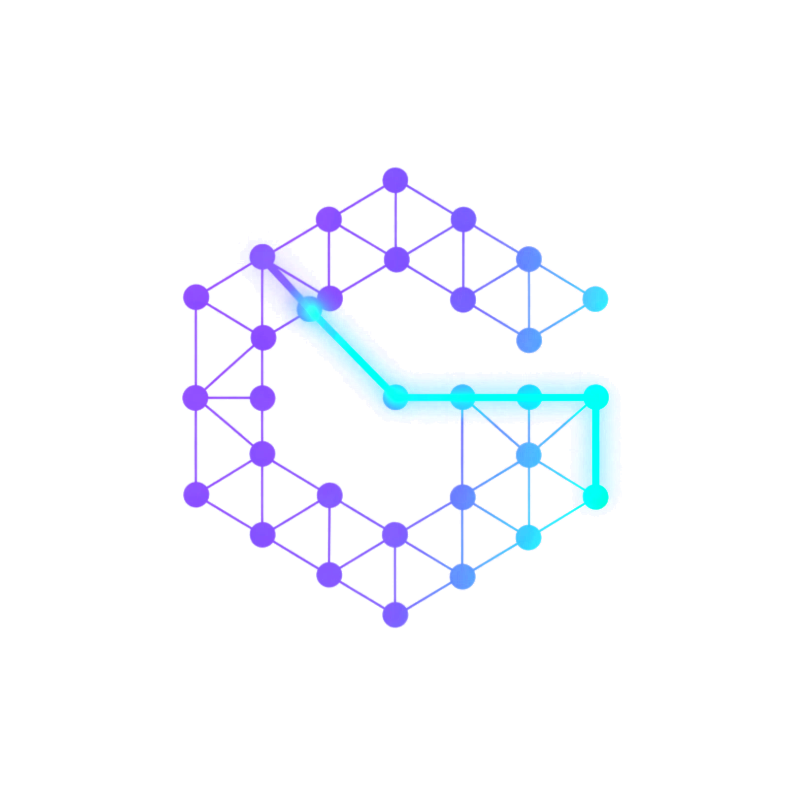

<p align="center">
  
</p>

# CodeGraph

CodeGraph turns a multi-repo codebase into a live knowledge graph, then puts three workflows on top of it so
engineers can see, question and repair the system from one dashboard. A human approves every code change.

| Workflow | What it does | Changes code? |
|---|---|---|
| **View Graph** | Explore how repos, files, components, endpoints, tables and packages connect, including links across repos. | No |
| **Ask AI** | Ask a question in plain English and get an answer with real file names and line numbers. | No (read-only) |
| **Fix Bugs** | Paste an error. An agent finds the cause, proves it with a failing test, applies a minimal fix and opens a PR, with 4 human approval gates. It stops at the open PR; a person merges it. | On a branch, after approval. Never merges. |

The graph is a map and the code is the truth: the graph tells the agents where to look, and the real files say
what is wrong. The graph is required for View Graph and optional for Ask AI and Fix Bugs.

The design is written up in [`docs/HACKATHON_DESIGN.md`](docs/HACKATHON_DESIGN.md).

## What is in this repo

| Path | What it is |
|---|---|
| [`codegraph/`](codegraph/README.md) | The API (`api/`, FastAPI) and the dashboard (`web/`, React + React Flow) |
| [`graphify/`](graphify/README.md) | The graph builder: extracts nodes and edges from the code and loads them into Neo4j |
| [`.cursor/`](.cursor) | Rules and skills that drive the Fix Bugs and Feature pipelines |
| [`repos.manifest.json`](repos.manifest.json) | The work repos the agents read and change, and where to clone them from |
| [`docker-compose.yml`](docker-compose.yml) | Optional Neo4j and graph-build job |
| [`setup.sh`](setup.sh) | One-shot setup script |
| [`docs/`](docs) | Design doc and slides |

The work repos themselves (`tb-common-mfe`, `tb-discovery-mfe`, `tb-marketing-xapi`, `tb-discovery-xapi`,
`tb-selection-xapi`, `kairos-fabric`) are **not** part of this repo. `setup.sh` clones them next to it, or links
existing checkouts, and they are git-ignored.

## Quick start

Requirements: git, Node 20+, Python 3.10+, the GitHub CLI (`gh auth login`), a
[Cursor API key](https://cursor.com/dashboard/integrations), and GitHub access to the work repos.
Docker is only needed for the graph view.

```bash
git clone git@github.com:rp278/code-graph-mono.git
cd code-graph-mono
./setup.sh                                   # gets the work repos, installs everything, creates config
# put CURSOR_API_KEY=... in codegraph/api/.env

cd codegraph/api && .venv/bin/uvicorn src.main:app --port 8000     # terminal A: API
cd codegraph/web && npm run dev                                    # terminal B: dashboard, http://localhost:5173
```

Ask AI and Fix Bugs work at this point. For **View Graph**, start Neo4j and build the graph (optional):

```bash
docker compose --env-file codegraph/api/.env up -d neo4j
docker compose --env-file codegraph/api/.env run --rm graphify
```

The full, step-by-step guide, settings, Docker notes and troubleshooting are in **[SETUP.md](SETUP.md)**.

## How it fits together

```
work repos ──► graphify ──► Neo4j ──► API (FastAPI) ──► dashboard (React)
    ▲                                    │
    └────────── Cursor SDK agents ◄──────┘   (Ask AI, Fix Bugs, Feature pipeline)
```

The API and the agents run on your machine because they need your git and `gh` credentials and edit the real work
repos. Neo4j and the graph build can run in Docker.

## Notes

- The bug pipeline **never merges**: it stops with the PR open for a human to review and merge.
- Never commit secrets: `.env` files are git-ignored, and only `*.example` files are tracked.
