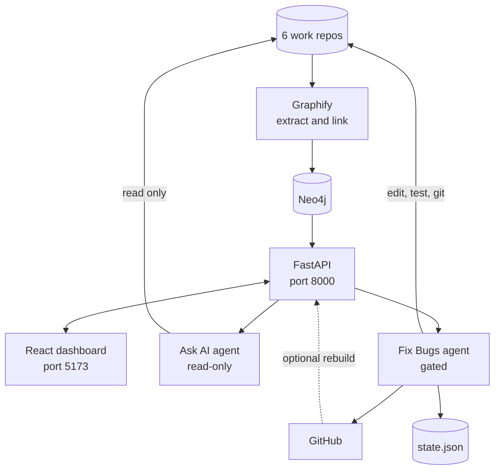
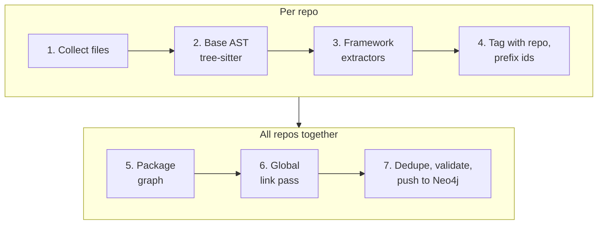
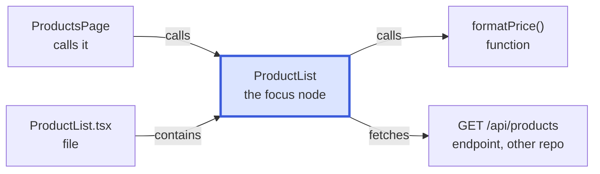
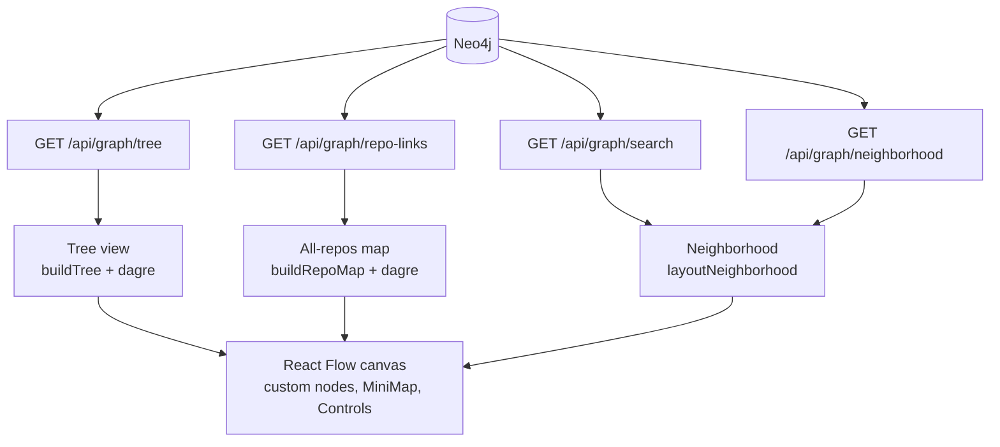
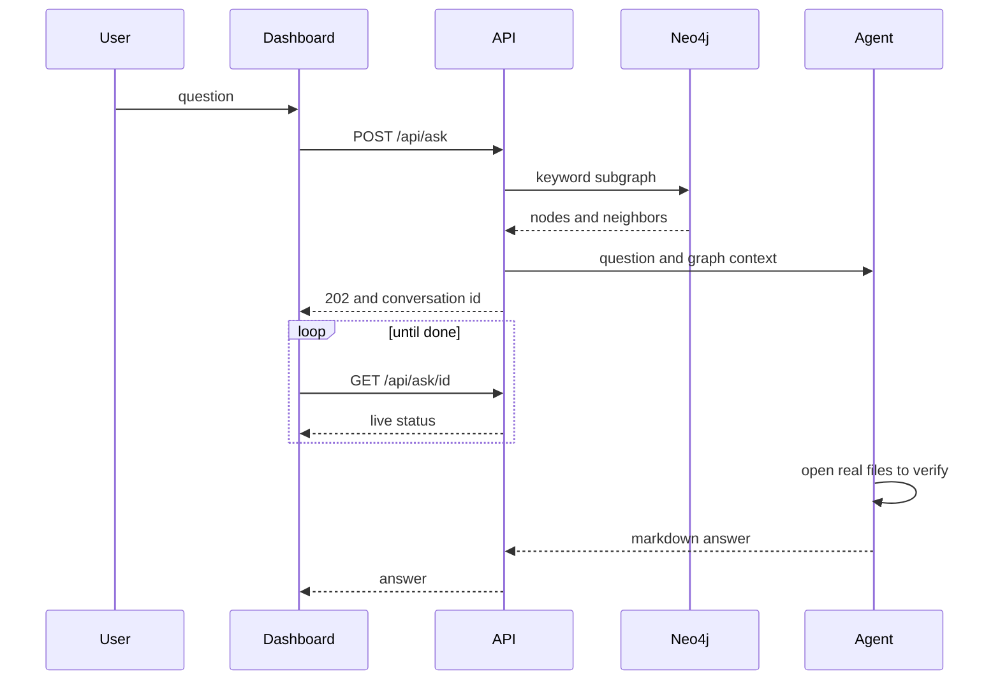
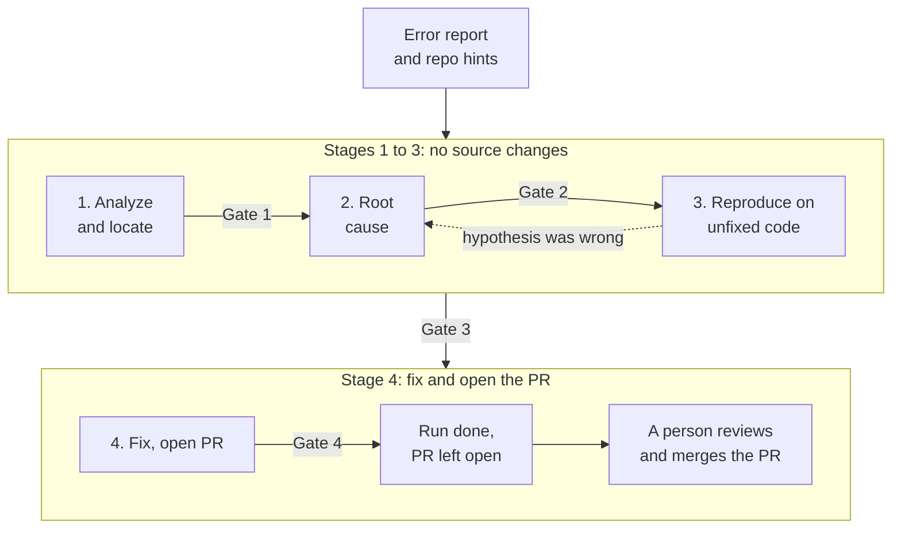
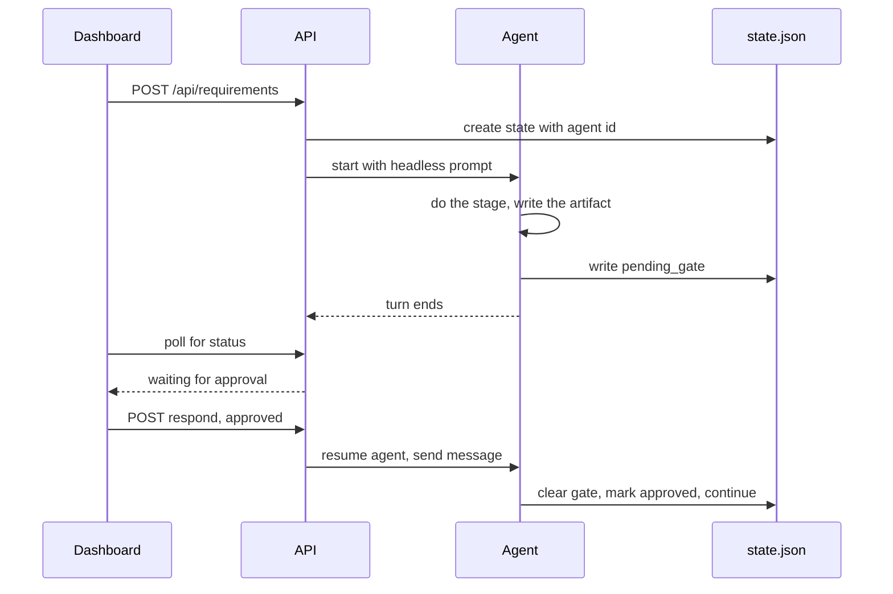

# CodeGraph — Design Doc

**One line:** CodeGraph turns a multi-repo codebase into a live knowledge graph (built by **Graphify**, drawn with **React Flow**), then puts three workflows on top of it — **View Graph**, **Ask AI** and **Fix Bugs** — so engineers can see, question and repair the system from one dashboard, with a human approving every change to code.

---

## 1. Problem

- Our product spans six repos: two micro-frontends (`tb-common-mfe`, `tb-discovery-mfe`), three experience APIs (`tb-marketing-xapi` in TypeScript, `tb-discovery-xapi` and `tb-selection-xapi` in Java) and a shared design-system library (`kairos-fabric`). A frontend call in one repo reaches an endpoint in another, and no single tool shows that link.
- General coding agents guess. They grep, miss cross-repo consumers, and change code with no audit trail.
- Teams don't trust unattended AI changes. They need evidence at each step, and a way to stop the agent.

## 2. Solution

| Workflow | What it does | Can it change code? |
|---|---|---|
| **View Graph** | Explore how repos, files, components, endpoints, tables and packages connect, including links *across* repos. | No |
| **Ask AI** | Ask a question in plain English and get an answer with real file names and line numbers. | No (read-only) |
| **Fix Bugs** | Paste an error. An agent finds the cause, proves it with a failing test, fixes it minimally, and opens a PR, with 4 human approval gates. It stops at the open PR, and a person merges it. | Yes, on a branch, after approval. It never merges. |

All three sit on the same foundation:

1. **A cross-repo knowledge graph**, built by **Graphify** and stored in Neo4j. It is built deterministically from the code, with no LLM at build time.
2. **A React dashboard**, which draws the graph with **React Flow** and hosts the Ask AI and Fix Bugs screens. It also has a **Feature Development** screen, which drives the sibling feature pipeline (it merges its own PRs after a 5-gate flow). That screen is hidden unless the cookie `cg_feature_development_enabled=true` is set, and it is outside the scope of this document.
3. **Cursor SDK agents**, which are grounded by the graph and can read the real code.

### Core principle: the graph is a map, the code is the truth

The graph tells you and the agents *where to look*: which repo, which file, and who consumes an endpoint. The real files say *what is wrong*. The graph is a snapshot of the last rebuild. It is **required for View Graph** and **optional for Ask AI and Fix Bugs**: if it is down or has no match, those agents search the code themselves and say so in their output.

### Key terms

| Term | Meaning |
|---|---|
| **Node / edge** | A node is a thing in the code: a source symbol (file, function, class, method), a component, page, endpoint, package, service or SQL table. An edge is a relationship between two nodes (`calls`, `imports`, `fetches`, …). |
| **Neighborhood** | One node plus every node directly connected to it by a single edge (one hop), in either direction and in any repo, together with those edges. Explained in section 5.4. |
| **Hop** | One edge. Walking from a node to its neighbor is one hop. |
| **Service** | Another backend that our code calls through a base-URL env var (for example `SELECTION_XAPI_BASE_URL`). It is a node of its own, so a call to it shows up even when no literal URL is in the code. |
| **Repo map** | The opening view of Explore: one box per repo and one arrow per pair of repos that depend on each other (section 5.3). |
| **Blast radius** | Everything that depends on a piece of code: its callers, importers and API consumers, including in other repos. Fix Bugs uses it to decide what must not change. |
| **`EXTRACTED` / `INFERRED`** | `EXTRACTED` edges are read directly from a declaration in the source, such as an import, a route definition or a `package.json` dependency. `INFERRED` edges are worked out by a fixed rule: a `calls` edge matched by function name, a `fetch` URL matched to an endpoint, a proxy route, or a table read found in a query string. Neither kind uses an LLM. |
| **Gate** | A point where the Fix Bugs agent stops and a human must approve before it continues. |

---

## 3. System architecture



| Layer | Path | Role |
|---|---|---|
| Graph builder | `graphify/` | Extracts nodes and edges per repo, links them across repos, and pushes them to Neo4j. |
| API | `codegraph/api/src/` | `main.py` (graph queries, rebuild), `ask_agent.py` (Ask AI), `pipeline_agent.py` (Fix Bugs). |
| Dashboard | `codegraph/web/src/` | Landing page, plus one screen per workflow. |
| Agent behavior | `.cursor/rules/`, `.cursor/skills/` | Gate policy and the bug-fix pipeline skill. |
| Run state | `codegraph/pipeline/<slug>/state.json` | The single source of truth for a Fix Bugs run. |

**Stack:** Python and FastAPI, Neo4j, tree-sitter, React 19 and Vite, `@xyflow/react` (React Flow) with `dagre`, Cursor SDK (`cursor-sdk`, local runtime), and the `gh` CLI.

---

## 4. Graphify — the graph builder

**What it is.** Graphify started as an open-source tool (upstream `safishamsi/graphify`) that turns a folder into a knowledge graph. We use a **customized fork** and added a deterministic multi-repo path, `graphify/codegraph.py`. It reads source code only and uses no LLM, so the same code always produces the same graph. LLMs are used only to *read* the graph (Ask AI and Fix Bugs), never to create it.

**Run it:** `python -m graphify.codegraph --repos repos.json --push` (the dashboard's **Rebuild** button does the same).



1. **Collect files.** Skip `node_modules`, `dist`, `build`, `.git`, `.next`, `coverage`, virtual environments and similar folders. More folders can be added with `CODEGRAPH_SKIP_DIRS`.
2. **Base AST extraction.** Functions, classes, imports, calls and inheritance, using tree-sitter.
3. **Framework extractors.** Fastify, React, SQL, Next.js and Spring, plus service-call detection (table below). Test, mock and story files (`*.test.*`, `*.spec.*`, `*.stories.*` for JS and TS, `*Test.java` and `*Tests.java`, and anything under `__tests__`, `__mocks__`, `__snapshots__`, `e2e`, `visual-tests` or Java `src/test`) are skipped here, so a throwaway test route never becomes a fake endpoint. They are still read by the base AST step.
4. **Tag and namespace.** Every node and edge gets its repo name, and ids are prefixed `<repo>::`.
5. **Package graph.** Every `package.json` becomes a `package` node with dependency edges.
6. **Link pass.** Resolve pending calls, service dependencies and proxy routes into edges that cross repos (section 4.2).
7. **Dedupe, validate and push.**

### 4.1 What gets extracted

| Extractor | Reads | Produces |
|---|---|---|
| **Base AST** (`extract.py`) | JS, TS, Java and other languages via tree-sitter | file, function and class nodes, plus `contains`, `method`, `calls`, `imports`, `imports_from`, `inherits` edges |
| **Fastify** (`extract_frameworks.py`) | route registrations such as `fastify.get('/path', handler)`, plugin `prefix` options | `endpoint` nodes, and `exposes_endpoint` edges from the file that registers them |
| **React** (`extract_frameworks.py`) | capitalized functions that return JSX, `<Route>`, `fetch('/api/...')`, `axios.*` | `component` and `page` nodes, `route` edges, and *pending* fetch calls |
| **SQL** (`extract_frameworks.py`) | `CREATE TABLE`, query strings | `table` nodes, `reads_table` and `writes_table` edges |
| **Next.js** (`extract_backends.py`) | `app/**/route.ts`, `app/**/page.tsx` | `endpoint` and `page` nodes (URL derived from the folders), with `exposes_endpoint` and `route` edges |
| **Spring** (`extract_backends.py`) | `@RestController` or `@Controller` classes with `@GetMapping` and similar, base path from `application.yml` or `.properties` | `endpoint` nodes for the Java `xapi` repos |
| **Services** (`extract_services.py`) | env-var base URLs such as `MARKETING_XAPI_BASE_URL` or `NEXT_PUBLIC_SELECTION_XAPI_BACKEND_URL`, plus the path strings in the same file | a `service` node for the target repo (an `external` stub if it isn't in the workspace), a `calls_service` edge, and `fetches` edges narrowed to that service's real endpoints |
| **Packages** (`extract_packages.py`) | every `package.json` with a name, plus real `import` and `require` statements | `package` nodes, `depends_on` and `uses_package` edges, and a `drift` flag when a consumer's pinned version differs from the version in source |

The framework, Next.js, Spring and service extractors are rules for well-known conventions. They observe **one file at a time**.

### 4.2 The link pass (what makes it cross-repo)

An extractor can only say "component X calls `GET /api/products`, target unknown", so it records a **pending edge**. After **all** repos are extracted, the link pass builds one global registry of `(method, path)` to endpoint node and resolves each pending call:

1. exact method and path match,
2. a path match that tolerates `:param` segments, so `/api/products/42` matches `/api/products/:id`. This second step ignores the HTTP method.

It also follows **API-client wrappers** (component to helper function to endpoint, assumed to be `GET`), and it has two more ways to connect repos, because in our codebase a call to another service rarely contains a literal `/api/...` URL:

- **Service calls.** A file that builds a URL from an env var such as `SELECTION_XAPI_BASE_URL` depends on the `tb-selection-xapi` service. That becomes a `calls_service` edge to a `service` node. The path strings in the same file are then matched to that service's real endpoints and become `fetches` edges (weight 0.8 for an exact match, 0.5 for a prefix match). If the service is not one of our registered repos, it lands in a stub `external` repo, so the dependency is still visible.
- **Proxy routes.** A Next.js catch-all route (`proxies_to` edges) forwards to another repo in two cases. Either its URL names that repo (for example `.../selection-xapi/[...path]`), and it is then linked to **every** endpoint of that repo (weight 0.8), or its static URL prefix (at least two segments) matches that repo's endpoint paths (weight 0.7). A bare `/api/:path*` is never linked, because it would match everything.

Resolved cross-repo edges (`fetches`, `proxies_to`) are `INFERRED`, while `calls_service` is `EXTRACTED` because the env var is right there in the source. The Explore canvas draws every `INFERRED` edge dashed.

> Design rule: **extractors observe, linkers connect.** Keeping the two apart is what lets one repo's frontend link to another repo's backend.

### 4.3 Graph model

- **Node types:** `code` (every file, function, class and method; the UI splits it by label), `component`, `page`, `endpoint`, `package`, `service` and `table`. Each repo also has a separate `Repo` root node. Ids are prefixed `<repo>::`, so same-named files (`index.ts`) or routes (`GET /ping`) in different repos don't merge. Package and service ids are global, so one package (or one service) is one node however many repos use it.
- **Edges:** `contains`, `method`, `calls`, `imports`, `imports_from`, `inherits`, `exposes_endpoint`, `route`, `reads_table`, `writes_table`, `depends_on`, `uses_package`, plus the custom cross-repo `fetches`, `proxies_to` and `calls_service`.
- **Properties:** `gid`, `label`, `type`, `repo`, `source_file`, `source_location` (`L<line>`), `confidence`, `weight`. Edges can also carry extras such as `drift` and `version_spec` (package edges).

### 4.4 Storage and rebuilds

- Neo4j layout: `(:Repo)-[:CONTAINS]->(:Node)`, and edges become typed relationships between `Node`s by `gid`.
- **Idempotent per repo:** each rebuild `DETACH DELETE`s that repo's nodes and re-`MERGE`s them, so there are no duplicates and other repos are untouched.
- **Rebuild API:** `POST /api/graph/rebuild` runs `git pull --ff-only` on the graphify checkout and on every registered repo, then re-extracts and pushes **all** repos, because cross-repo edges need everyone (10-minute timeout). It is **single-flight**: a request that arrives mid-build returns `queued` and makes the running build repeat once more when it finishes, so it is neither dropped nor run in parallel.
- **Optional auto-rebuild.** The `graphify` repo has a GitHub Action (`rebuild-codegraph.yml`) that calls the rebuild API on every push to its `master`. It does nothing unless the repository variable `CODEGRAPH_REBUILD_URL` is set. The six work repos do not have this workflow.

**Current graph** (read from the live API when this document was written): about **13,200 nodes and 35,900 edges** across the 6 registered repos, plus a 1-node `external` stub. By type: 12,235 `code` symbols (files, functions, classes), 839 components, 88 endpoints, 19 pages, 18 packages and 4 services. The graph changes with every rebuild, so treat these numbers as a snapshot.

---

## 5. Workflow 1 — View Graph (React Flow)

**Goal:** let anyone see how the system really connects, without reading code. View Graph reads the graph straight from Neo4j, so it needs Neo4j running and a built graph.

### 5.1 Why React Flow

The graph has about 13,000 nodes and 36,000 edges. React Flow (`@xyflow/react` v12) gives us pan, zoom, a minimap, controls, custom node components, styled and animated edges and click handling, so we spend our time on **what to show** and not on a canvas engine. Positions come from `dagre` (automatic layout, used by the Tree and the All-repos map) or from our own `layoutNeighborhood` function (used for a node's neighborhood in Explore). The dark theme, dotted background, `MiniMap` and `Controls` are shared by every view.

### 5.2 The two views

| View | Endpoints | How it draws | Best for |
|---|---|---|---|
| **Explore** (default) | `/api/graph/repo-links`, `/api/graph/search`, `/api/graph/neighborhood` | Starts on the **All-repos map** (section 5.3). Pick a node and it shows **that node and its neighborhood** (section 5.4). A side panel lists repos, a search box with type filters, and entry points. Click any node on the canvas to walk to it. A breadcrumb trail steps back. Relation chips hide edge types. | Following a call chain or an API across repos |
| **Tree** | `/api/graph/tree` | The client builds a repo, folder, file, class and method tree, collapsing single-child folders (`a/b/c`). Only expanded rows are laid out, left to right with `dagre`. Click a row to expand it. **Collapse all** resets. Not capped at a few hundred nodes. | Browsing a repo like a file explorer |

The View Graph header also has an **Ask AI** tab, and the chips under an Ask AI answer jump straight into Explore on that node.

### 5.3 The All-repos map (where Explore starts)

With **All repos** selected and no node picked, Explore shows one box per repository and an arrow wherever code in one repo depends on another. It answers "how do our repos fit together?" before you dive into any code.

- **Data.** `GET /api/graph/repo-links` counts every edge whose two ends are in different repos, grouped by source repo, target repo and relation type (for example `tb-discovery-mfe` to `tb-common-mfe`, `uses_package`, 9).
- **One arrow per repo pair.** Both directions are merged into a single arrow that points from the repo with more links (the consumer) to the other (the provider). Each relation gets its own label line, such as "uses package ×9" or "proxies to ×36", biggest first. Links going the opposite way are marked with a reverse arrow in the label.
- **Reading the arrow.** Thickness grows with the total link count (log scale), the color follows the main relation, and the arrow is **dashed** when the main relation is inferred (`fetches`, `proxies_to`).
- **Layout.** `buildRepoMap` lays the repos out left to right with `dagre`, so consumers sit on the left and the libraries and services they use sit on the right. A custom edge, `RepoLinkEdge`, follows dagre's route around boxes and stacks the labels.
- **Stubs and loners.** A service outside the workspace shows up as an `external` box marked "not in workspace". A repo with no cross-repo edges says "no links to other repos".
- **Next step.** Click a repo box to open that repo, then click an entry point to start walking.

With a single repo selected and no node picked, the canvas shows that repo in the middle with its entry points around it instead.

### 5.4 What is a neighborhood?

A node's **neighborhood** is the node itself plus every node connected to it by a **single edge**, in **either direction** and in **any repo**, together with those edges. It is one hop out, nothing further.

Example (illustrative): the neighborhood of the component `ProductList`.



**How the dashboard uses it**

- **Left and right.** Nodes that point *at* the focus (callers, importers, the parent file) go on the **left**. Nodes it points *to* (things it calls, imports or fetches) go on the **right**. The side panel labels this "used by / parent" and "uses / children".
- **Walking the graph.** Clicking a neighbor makes *it* the new focus and shows *its* neighborhood. Each click is one hop, and the breadcrumb records the path so you can step back.
- **Across repos.** Neighbors may live in another repo, and are marked as such. This is how you follow a `fetches` edge from a frontend into a backend.
- **Before you pick a node.** With all repos selected you get the repo map (section 5.3). With one repo selected you get a synthetic "hub": the repo in the middle, surrounded by its entry points. Entry points are packages, pages and endpoints first, then the most connected nodes.

**How the API builds it** (`GET /api/graph/neighborhood?node_id=…`)

- It matches every edge touching the node, in either direction, and returns the focus node, its neighbors, and the edges that connect the focus to them. Edges between two neighbors are not included.
- It returns at most **150** links by default (500 at most), most-connected neighbors first.
- `total` is the true number of links, so the UI can say "only the N most-connected of M links were loaded". It counts links (edges), not distinct neighbors.
- The canvas draws up to **48 neighbors per side**, in columns of at most 11 rows so a big neighborhood grows sideways and not into one long list. **Show all** draws everything that was loaded.

**Why it exists.** Drawing 13,000 nodes at once is unreadable. A neighborhood is always small enough to read, and clicking through neighborhoods lets you reach anything in the graph.

### 5.5 Data flow



### 5.6 Visual language

Each node type has its own color (`graphUtils.js`): endpoint pink, page violet, component blue, file slate, function green, class amber, table orange, package teal, service rose, repo fuchsia. `INFERRED` edges are dashed, `calls` edges are animated, and edge labels appear when 10 edges or fewer are visible. The graph stores every source symbol as one `code` type, so the UI splits it into file, function or class from its label. Custom React Flow node components (`KgNode`, `TreeNode`) show the label with a "kind, repo, line" line underneath, and have left and right handles for edges. The All-repos map adds a custom edge, `RepoLinkEdge`, with stacked "relation ×count" labels.

### 5.7 Design decisions

| Decision | Why |
|---|---|
| Never draw the whole graph. Draw a repo map, a tree, or one neighborhood. | 13,000 nodes on one canvas is unreadable. Progressive disclosure stays usable at any size. |
| Start on the repo map, with one merged arrow per repo pair. | It gives the architecture at a glance, and hides the ~36,000 individual edges behind counts. |
| A dedicated `/tree` endpoint returns every node but only parent-to-child edges. | The tree needs all the nodes and few edges, so it isn't capped at a few hundred. |
| The neighborhood endpoint reports the true `total`. | The UI can be honest when a result was capped. |
| An empty search returns entry points. | The user always has somewhere to start. |
| Ask AI is reachable from the graph, and its chips jump to a node. | The question and the map stay linked. |

---

## 6. Workflow 2 — Ask AI

**Goal:** answer "where / how / who calls" questions about the code, with real file names and line numbers.

**User flow:** open **Ask AI**, optionally scope to one repo, and ask. Follow-ups keep context.



| Decision | Why |
|---|---|
| The agent's toolset is restricted to `read`, `grep`, `glob`, `ls`. | Read-only is **enforced by the SDK at agent creation**, not requested in the prompt. The agent has no shell, edit or delete tool. |
| A small subgraph is pre-fetched and put in the prompt. | It tells the agent where to look. It is keyword-based: up to 8 keywords, matched against node labels, at most 25 nodes, each with up to 6 neighbor names. If the graph and a local file disagree, the agent trusts the file and says so. |
| One conversation is one Cursor agent. | Follow-ups keep context. After an API restart, the agent resumes by id from the on-disk store. |
| It runs in a background thread, and the UI polls a live status. | Users see "Running `grep` — …" instead of a bare spinner. |
| `ASK_MODEL` is separate from `PIPELINE_MODEL`. | Q&A can use a cheaper, faster model. |

**Failure modes:** no graph match, so the agent searches the code by itself. `CURSOR_API_KEY` is missing, which returns a clear 400. The conversation has expired, so the user starts a new one.

---

## 7. Workflow 3 — Fix Bugs

**Goal:** paste an error and get a minimal, test-proven fix as an **open pull request**. The human checks the *reasoning* at four gates, then reviews and merges the PR. **The pipeline never merges.**

**Input** (the dashboard's "New bug" form, then **Start fix pipeline**):

| Field | Required | Notes |
|---|---|---|
| Error message or stack trace | Yes | The primary evidence, kept verbatim. |
| Title | No | Derived from the error when blank. |
| Repos | No | Chips for the suspected repos, or **Not sure**. A hint, not a constraint: if the evidence points elsewhere, the agent says so. |
| Extra details | No | When it happens, what changed recently. |



Every arrow labelled "Gate" is a mandatory human approval. The last box is outside the pipeline on purpose: the run is finished when the PR is open and Gate 4 has passed.

### 7.1 Stage by stage

| Stage | What the agent does | Artifact |
|---|---|---|
| **1. Analyze and locate** | Pulls signals out of the error (paths, line numbers, function names, routes, table names, error class). Locates the bug with the graph, then walks outward to get the **blast radius**. If the graph is down or has no match, it searches every repo checkout itself and says which path it used (`Graph: used`, `Graph: no matching nodes`, or `Graph: unavailable`). Writes current, expected and unchanged behavior in `WHEN … THEN … SHALL` form, plus a provisional scope fence. | `bugfix.md` |
| **2. Root cause** | Reads the real code and traces the failing path. States one hypothesis with `file:line` evidence, a **bug condition C**, a **postcondition P**, what must be preserved when C is false, alternatives considered, the proposed fix (approach only) and the final scope fence. No code changes. | `rootcause.md` |
| **3. Reproduce** | Creates the branch `pipeline/<slug>/<repo>`. Writes a **bug-condition test** that must fail on the unfixed code for the predicted reason, and **preservation tests** that must pass. Runs the repo's own `test` script and records the real output. Only test files and `.pipeline/<slug>/` may change. If a test can't express the bug (race, timing, environment), it says so and gives manual repro steps. | `repro.md` and the tests |
| **4. Fix** | Applies the smallest change inside the scope fence. Runs the full suite, plus lint and build when the repo has them. Tests are never edited or weakened to pass, and a wrong test means resetting Gate 3. Checks the diff against the fence, writes a traceability table (each expected and unchanged clause to its test and code), commits, pushes and opens the PR. | `fix.md` (also the PR body) |

| Gate | State key | The reviewer confirms |
|---|---|---|
| 1 | `1_analysis` | We understood the symptom and found the right place. |
| 2 | `2_rootcause` | The hypothesis is plausible, and the scope fence is right. |
| 3 | `3_repro` | A test **fails on unfixed code for the predicted reason**, and preservation tests pass. |
| 4 | `4_fix` | The change is minimal, in scope, and the tests now pass. |

**When Gate 4 is approved, the run is done.** The agent leaves the PR untouched, records `merge_status: "not_merged"` and stage `done` in `state.json`, and ends with the PR link and a note that it is ready for a person to review and merge. There is no separate QA-checklist or hand-off stage: the traceability table in `fix.md` (each expected and unchanged clause mapped to its test and code) is what the reviewer uses to check the fix.

### 7.2 What makes this different from "ask an agent to fix it"

1. **Test-first, and falsifiable.** The root-cause hypothesis is a claim. Stage 3 exists to *falsify* it. If the failing test fails for a different reason, or doesn't fail, the pipeline returns to Stage 2 and does not proceed with a caveat.
2. **No source changes before Gate 3.** Stages 1–3 may only add `.pipeline/<slug>/` files and test files.
3. **Scope fence.** Gate 2 fixes which files and functions the fix may touch. Leaving the fence means widening it and re-presenting Gate 2.
4. **Preservation tests from the graph.** Unchanged behavior comes from the **blast radius**, including consumers in *other* repos, which is exactly what Graphify's cross-repo edges provide.
5. **"No test" is a stated outcome, never silent.** For races or environment-only bugs, `repro.md` gives the reason and manual repro steps with observed output.
6. **Every gate is mandatory.** None is skipped, deferred or auto-approved. Silence or a blanket "looks fine" is not approval, and a rejection loops back to the stage that produced the artifact.
7. **It never merges.** The agent may not run `gh pr merge`, call the merge API, enable auto-merge, or push to the base branch. A "merge it" message inside a run does not override this, and the agent tells the user to merge the PR themselves. The last human decision (merge or not) stays with a person.

### 7.3 Headless approvals (how the dashboard replaces chat)

The agent runs through the Cursor SDK, so it can't ask questions interactively. Instead it writes a `pending_gate` marker and stops. The dashboard shows it, and an approve or revise click resumes the same agent.



- **`state.json` is the single source of truth.** It holds one `agent_id` for the run, and one entry per repo story with its gate statuses, branch, PR URL, `pending_gate` and `merge_status`. It lives only in `codegraph/pipeline/<slug>/`, so copies can't drift.
- **Runs survive restarts.** The agent store is persisted as JSONL on disk, and `agent_id` is recorded in `state.json`, so the agent can be resumed after an API restart.
- **Turns are strictly serial.** Responses given while the agent is busy are **queued** and sent in order. Duplicate answers to the same gate are rejected.
- **Live status.** Each SDK message (thinking, tool call, text) becomes a one-line status in the UI, polled every 1.5 seconds.
- **Run states.** The dashboard shows one of: *Idle*, *Starting*, *Running*, *Waiting on you* (a gate is open), *Paused*, *Done* (PR open and Gate 4 approved) or *Error*. While a run is working, the header shows the state as a pill with an icon-only **Pause** button beside it. **Restart** and **Delete** sit on the right and are enabled whenever the agent is not mid-turn.
- **Done means the PR is open.** When every story reaches stage `done`, the run shows **Done**. That means "PR open and Gate 4 approved", not "merged".
- **Pause and Resume.** While the agent is working, **Pause** cancels its in-flight step through the SDK. `state.json` and the repos are left as they are, so the step may be half-finished. Responses queued in the meantime are kept. The header shows **Paused**, and **Resume** continues the *same* agent with a message telling it to re-check what it had actually finished before carrying on. Restart and Delete are available while paused. A pause that arrives just as a turn finishes normally is ignored.
- **Restart.** This starts the *same* run over: same slug and report, every gate cleared, and a fresh agent at Stage 1. The repos are not cleaned up. The earlier branches and PRs stay, are recorded under `restarts` in `state.json`, and the new agent is told to leave them alone and cut a new `-r<N>` branch. It is refused while the agent is mid-turn (pause it first).
- **Delete.** This removes the run's record (`codegraph/pipeline/<slug>/`) after a confirmation in the dashboard. Branches, PRs and `.pipeline/<slug>/` files in the repos are not touched. It is refused while the agent is mid-turn (pause it first).

### 7.4 Changing the report mid-run (cascade)

If the bug details change while a run is in flight (new symptoms are the usual case):

1. Find the **earliest already-approved gate whose artifact the change invalidates**. This may be earlier than the gate that is currently open. New symptoms typically invalidate `2_rootcause` and everything after it.
2. Reset that gate and every later gate. Leave unaffected gates alone.
3. Update all affected artifacts and **re-verify live**. A text find-and-replace is not enough.
4. Re-present only the reset gates, and log the cascade in `state.json` `notes`.

A bug that regresses after someone merged the fix is a **new run** with its own slug and a full gate cycle. Merges are never rolled back or hot-fixed outside the pipeline.

### 7.5 Artifacts and the PR

```
<repo>/.pipeline/<slug>/          committed on the story branch,
                                  so it travels with the PR
  bugfix.md                       analysis
  rootcause.md                    hypothesis, condition, scope fence
  repro.md                        real test output on unfixed code
  fix.md                          what changed, results, traceability
  state-ref.json                  pointer to the canonical state.json
```

- Branch: `pipeline/<slug>/<repo>`. The PR body is `fix.md`. The write-scoped token used for this comes from the keychain and is never printed.
- **The PR stays open.** After Gate 4 nothing touches it. A person reads the diff and the artifacts, then merges it (or doesn't).
- **PRs are informational only.** Gates are approved in the dashboard, and no gate depends on GitHub PR state.
- **The dashboard's step bar for bug runs ends at "Fix".** The "Merged" step only appears for feature runs, because bug runs never merge.
- **The graph does not update by itself after a merge.** Press **Rebuild** to pick up the fix. The optional auto-rebuild Action (section 4.4) exists only in the `graphify` repo, so a merge in a work repo does not trigger it unless the same workflow is added there.

---

## 8. Safety model

| Workflow | Can it change code? | Guardrail |
|---|---|---|
| View Graph | No source edits | The dashboard reads the graph through read endpoints. The one exception is **Rebuild**, which rewrites the graph and runs a fast-forward-only `git pull` in each repo. `/api/query` also rejects write keywords (`CREATE`, `MERGE`, `DELETE`, …), but that is a keyword filter and not a full guarantee. |
| Ask AI | **No** | SDK-enforced toolset of `read`, `grep`, `glob`, `ls`. No shell or edit tool exists for that agent. |
| Fix Bugs | Yes, on a branch, and never on the base branch | 4 gates, no source edits before Gate 3, scope fence, minimal-change rule, and **no merge**: the run ends at an open PR that a person merges. These are rules the agent must follow (in `.cursor/rules` and the skill). Unlike Ask AI's toolset, they are not a technical block, because this agent has a shell and `git`. |

Other controls:
- Optional bearer token (`API_TOKEN`) on every route except `/health`, plus an explicit CORS origin allowlist.
- Secrets live only in `.env` files.
- LLMs never create graph nodes or edges. The graph is deterministic.

---

## 9. Future work

- Incremental rebuilds instead of full rebuilds, and repo-relative graph paths.
- More extractors (other frameworks and message queues), and a check that flags unresolved `fetch` calls.
- Explore: saved trails, shareable links to a node, and a diff of the graph between two rebuilds.
- Semantic search to pick better graph context for Ask AI.
- Multi-user approvals with identity, and per-repo owners.
- Run the pipeline in isolated worktrees instead of the user's checkouts.
- Track metrics: time per gate, revise rate, and how often the hypothesis was falsified.

---

## Appendix A — API surface

| Method | Path | Purpose |
|---|---|---|
| GET | `/health` | Liveness and Neo4j status |
| GET / POST | `/api/repos` | Repo registry |
| GET | `/api/graph/stats` | Counts by repo and type |
| GET | `/api/graph/tree` | Every node plus parent-to-child edges, for the Tree view |
| GET | `/api/graph/repo-links` | Cross-repo edge counts per (source repo, target repo, relation), for the All-repos map |
| GET | `/api/graph/search` | Find nodes by label, or entry points when the query is empty |
| GET | `/api/graph/neighborhood` | One node plus its direct neighbors, across repos |
| GET | `/api/graph` | Capped node-link data (not used by the dashboard now) |
| POST | `/api/query` | Cypher, with write keywords rejected |
| POST | `/api/graph/rebuild` | Pull, then rebuild the graph for all repos (single-flight, coalescing) |
| POST | `/api/ask` | Start or continue an Ask AI conversation |
| GET | `/api/ask/{conversation_id}` | Poll status and answer |
| GET / POST | `/api/requirements` | List runs, or start one. Send `kind: "bug"` for Fix Bugs (the API default is `feature`). |
| GET | `/api/requirements/{slug}` | Run detail, live status, queued and acted responses |
| POST | `/api/requirements/{slug}/respond` | Approve, revise, or send a change |
| POST | `/api/requirements/{slug}/pause` | Cancel the agent's in-flight step. 409 if the run isn't running |
| POST | `/api/requirements/{slug}/resume` | Continue a paused run with the same agent. 409 if it isn't paused |
| POST | `/api/requirements/{slug}/restart` | Start the same run over: same slug, all gates cleared, new agent. 409 while mid-turn |
| DELETE | `/api/requirements/{slug}` | Delete the run record. Repos are not touched. 409 while mid-turn |

## Appendix B — Related files

- `graphify/graphify/codegraph.py`: build entry point and link pass
- `graphify/graphify/extract_frameworks.py`, `extract_backends.py`, `extract_packages.py`, `extract_services.py`: the extractors
- `graphify/graphify/export_neo4j.py`: Neo4j export
- `codegraph/web/src/components/Explorer.jsx`, `TreeView.jsx`, `KgNode.jsx`, `RepoLinkEdge.jsx`: the React Flow views, nodes and custom edge
- `codegraph/web/src/graphUtils.js`, `treeUtils.js`: colors, neighborhood and repo-map layout, and tree building
- `.cursor/rules/pipeline-gates.mdc`, `pipeline-bugfix.mdc`: gate policy and the bug gates
- `.cursor/skills/bug-fix-pipeline/SKILL.md`: the step-by-step procedure
- `SETUP.md`: setup and troubleshooting
